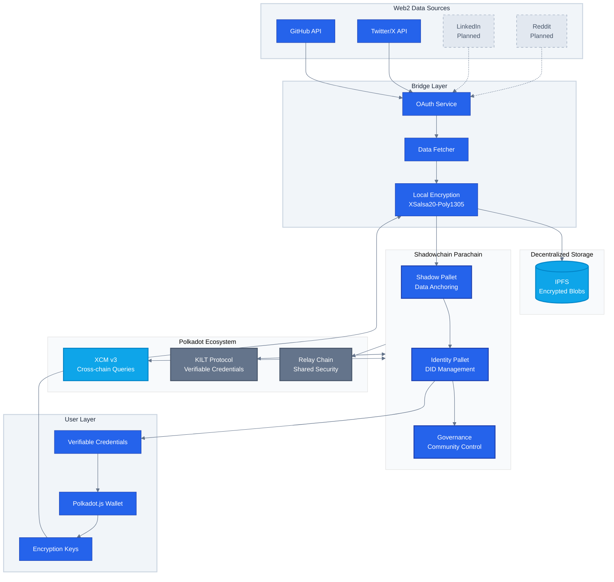
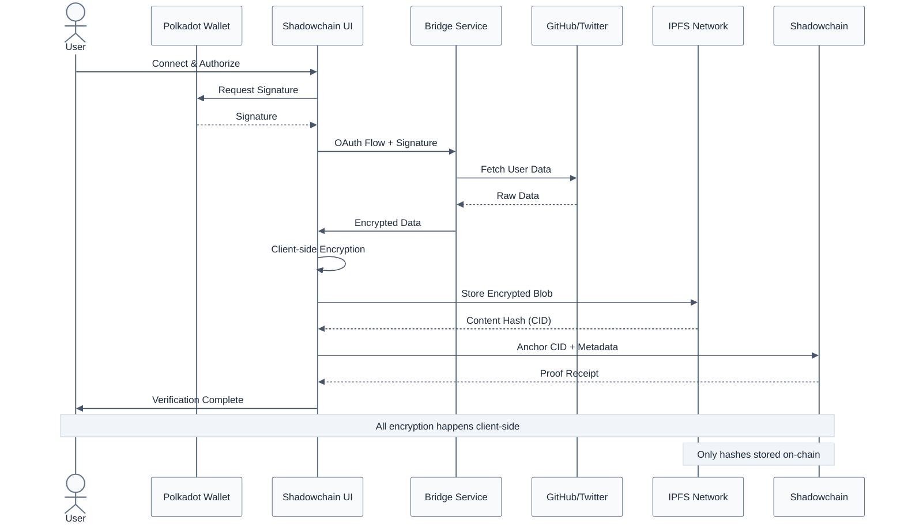
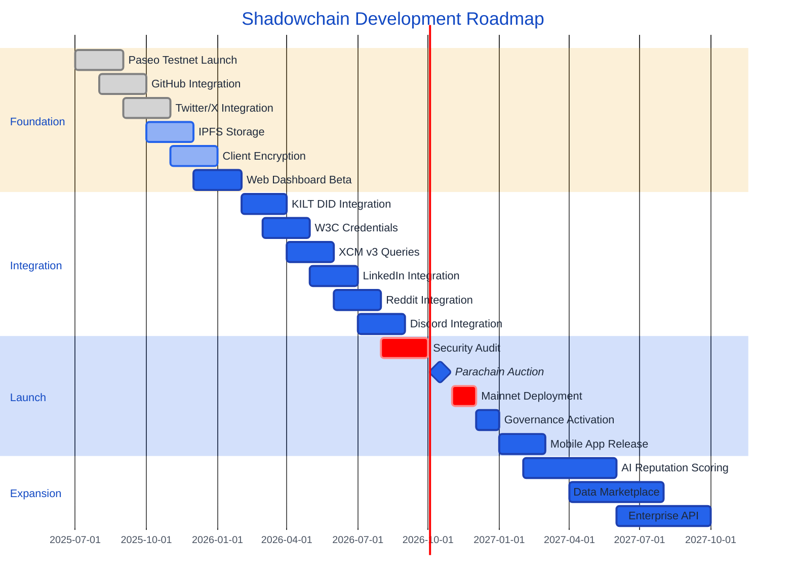
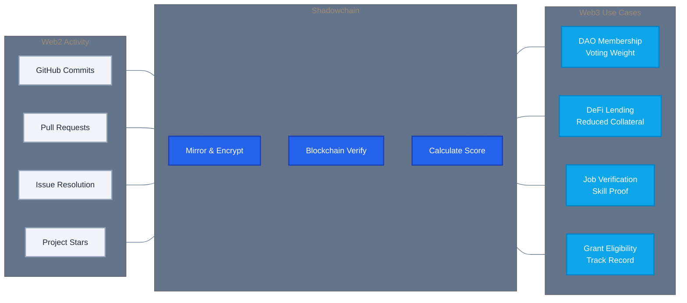

<div align="center">

# Shadowchain

## A Decentralized Reputation Layer for the Open Internet

[](https://github.com/paritytech/polkadot-sdk)
[](https://substrate.io)
[](https://ipfs.io)

*Transform your Web2 footprint into verifiable Web3 identity*

[**Live Demo**](https://shadowchain.locsafe.org) | [**Documentation**](docs/arch.md) | [**Discord**](#)

</div>

---

## Overview

Shadowchain is a decentralized identity and reputation platform built on Polkadot. It enables users to mirror their digital activities from centralized platforms (GitHub, Twitter/X, LinkedIn) into a blockchain-verified, user-controlled archive with encrypted IPFS storage.

Unlike traditional backup solutions, Shadowchain transforms your digital footprint into verifiable credentials that can be used across Web3 ecosystems through cross-chain interoperability.

---

## The Problem

Centralized platforms control user data, creating several critical issues:

**Platform Risk**
- Account suspensions result in immediate loss of digital history
- API changes lock out third-party tools and integrations
- Terms of service changes can monetize user content without consent

**Data Ownership**
- Users have limited control over their contributions
- Professional portfolios are siloed across multiple platforms
- Digital reputation is non-portable between services

**Verification Challenges**
- No cryptographic proof of contribution authorship
- Easy to fake credentials and professional history
- Difficult to prove authentic skill levels across platforms

---

## The Solution

Shadowchain provides a user-sovereign data layer that:

**Preserves Digital History**
- Blockchain-verified timestamps for all contributions
- Immutable record of professional and social activity
- Censorship-resistant archival storage

**Enables Data Portability**
- Export credentials to any Web3 application
- Cross-chain reputation queries via XCM
- W3C-compliant decentralized identifiers (DIDs)

**Generates Verifiable Credentials**
- Cryptographic proofs of skill and contribution
- Reputation scoring based on verified activity
- Selective disclosure of professional achievements

---

## Core Features

### For Users

**Data Sovereignty**
- User-controlled encryption keys
- Selective platform authorization
- Revocable access permissions

**Verifiable Identity**
- Blockchain-anchored timestamps
- Cryptographic proof of contributions
- Portable reputation across ecosystems

**Privacy Controls**
- Zero-knowledge encryption architecture
- Local data processing
- Selective credential disclosure

### For Developers

**Production-Ready Infrastructure**
- Custom Substrate parachain
- Optimized FRAME pallets with benchmarked weights
- XCM v3 integration for cross-chain queries

**Identity Standards**
- KILT Protocol compatibility for DIDs
- W3C Verifiable Credentials support
- Standard credential schemas

**Extensible Architecture**
- Oracle framework for Web2 data ingestion
- Plugin system for platform integrations
- Governance module for community control

---

## Architecture



### Technical Stack

**Blockchain Layer**
- Substrate 3.0+ with FRAME v2
- Custom Shadow pallet for data anchoring
- Benchmarked extrinsics for production deployment

**Storage Layer**
- IPFS for encrypted content storage
- XSalsa20-Poly1305 encryption (libsodium)
- Argon2id key derivation from wallet signatures

**Integration Layer**
- OAuth 2.0 for platform authorization
- Rate-limited data fetching
- Event-driven processing pipeline

### Data Flow



---

## Getting Started

### Prerequisites

- Node.js 18.x or higher
- Docker and Docker Compose
- Polkadot.js browser extension
- GitHub and/or Twitter account

### Installation

```bash
# Clone the repository
git clone https://github.com/tufstraka/shadowchain.git
cd shadowchain

# Install dependencies
make install-deps

# Configure environment
cp .env.example .env
# Edit .env with your OAuth credentials
```

### OAuth Configuration

**GitHub OAuth App**
1. Navigate to GitHub Settings → Developer Settings → OAuth Apps
2. Create new OAuth app with callback URL: `http://localhost:3000/auth/github/callback`
3. Add Client ID and Secret to `.env`

**Twitter OAuth App**
1. Visit Twitter Developer Portal
2. Create new app with OAuth 2.0 enabled
3. Add credentials to `.env`

### Launch Development Environment

```bash
# Start parachain node, IPFS, backend API, and frontend
make dev

# Access the application
# Frontend: http://localhost:3000
# Parachain RPC: ws://localhost:9944
```

### First Mirror

1. Open http://localhost:3000 in your browser
2. Connect Polkadot.js wallet
3. Authorize platform access (GitHub or Twitter)
4. Initiate data mirroring
5. View blockchain-anchored proofs at http://localhost:3000/dashboard

---

## Security and Privacy

### Encryption Architecture

**Client-Side Encryption**
- All data encrypted in browser before transmission
- Encryption keys never leave user's device
- Backend services operate on encrypted blobs only

**Key Management**
- Keys derived from Polkadot wallet signatures
- Deterministic key generation enables recovery
- Key rotation supported without data re-encryption

**Storage Security**
- Encrypted IPFS content addressing
- No plaintext metadata exposure
- Tamper-evident blockchain anchoring

### Privacy Guarantees

- Zero-knowledge architecture: backend cannot decrypt user data
- Selective disclosure: users control credential sharing
- Revocable authorization: OAuth tokens can be invalidated
- Anonymous usage: no personal information required beyond wallet

---

## Roadmap



### Phase 1: Foundation (Q3 2025 - Q1 2026)

**Q3 2025**
- Launch on Paseo testnet
- GitHub integration (commits, PRs, issues)
- Twitter/X integration (tweets, engagement)

**Q4 2025**
- IPFS storage implementation
- Client-side encryption deployment
- Web dashboard beta release

**Q1 2026**
- Performance optimization
- Security audit completion
- Community testing program

### Phase 2: Integration (Q2 2026 - Q3 2026)

**Q2 2026**
- KILT Protocol DID integration
- W3C Verifiable Credentials support
- XCM v3 cross-chain queries

**Q3 2026**
- LinkedIn data integration
- Reddit integration
- Discord activity mirroring

### Phase 3: Launch (Q4 2026 - Q1 2027)

**Q4 2026**
- Polkadot parachain auction participation
- Mainnet deployment preparation
- Governance module activation

**Q1 2027**
- Production launch
- Mobile application release
- Ecosystem partnerships

### Phase 4: Expansion (Q2 2027+)

- AI-powered reputation scoring
- Data marketplace for opt-in monetization
- Enterprise API for credential verification
- Multi-signature organizational accounts

---

## Use Cases

### Developer Reputation

**Problem**: GitHub portfolios can be suspended, deleted, or falsified.

**Solution**: Shadowchain provides blockchain-verified proof of code contributions, enabling:
- DAO membership based on verified development activity
- Undercollateralized DeFi loans using reputation
- Authenticated developer portfolios for hiring



### Content Creator Verification

**Problem**: Social media accounts can be shadowbanned, suspended, or impersonated.

**Solution**: Verifiable content history enables:
- Proof of original content creation
- Resistance to deplatforming
- Portable audience metrics across platforms

### Professional Credentials

**Problem**: LinkedIn profiles are locked behind corporate control.

**Solution**: Self-sovereign professional identity supports:
- Verifiable work history
- Portable professional networks
- Censorship-resistant career records

---

## Technology

### Substrate Pallets

**Shadow Pallet**
- Anchors encrypted IPFS hashes on-chain
- Tracks data lineage and updates
- Implements access control logic

**Identity Pallet**
- Links wallet addresses to DIDs
- Manages credential schemas
- Handles verification requests

**Governance Pallet**
- Community parameter control
- Upgrade proposal system
- Treasury management

### XCM Integration

Cross-chain reputation queries enable other parachains to:
- Verify user credentials without data migration
- Request specific attestations
- Implement reputation-based features

Example query from a DeFi parachain:

```rust
// Query developer reputation from Shadowchain
let reputation = XcmShadowchain::query_reputation(
    account_id,
    CredentialType::DeveloperScore
)?;

// Adjust loan terms based on verified reputation
if reputation.score > 750 {
    LendingPool::offer_reduced_collateral(account_id, amount);
}
```

---

## Contributing

Shadowchain is open source and welcomes contributions in:

**Development**
- Rust/Substrate parachain development
- TypeScript frontend and backend
- Mobile application (React Native)

**Design**
- UI/UX improvements
- Visual identity
- Documentation

**Infrastructure**
- DevOps and deployment
- Security auditing
- Performance testing

**Community**
- Technical documentation
- Translation and localization
- Community management

See [CONTRIBUTING.md](CONTRIBUTING.md) for detailed guidelines.

---

## Ecosystem

### Current Integrations

**Data Sources**
- GitHub (commits, PRs, issues, stars)
- Twitter/X (tweets, likes, retweets)

**Infrastructure**
- IPFS for decentralized storage
- Substrate for blockchain layer

### Planned Integrations

**Identity Providers**
- KILT Protocol for DIDs
- Litentry for aggregated identity
- ENS for domain-based identity

**Data Sources**
- LinkedIn (professional history)
- Reddit (community engagement)
- Discord (server participation)

**Cross-Chain**
- Phala Network for confidential compute
- SubSocial for decentralized social
- Polkadot Asset Hub for tokenization

---

## Community

### Connect

| Platform | Link |
|----------|------|
| **Website** | [shadowchain.locsafe.org](https://shadowchain.locsafe.org) |
| **GitHub** | [@tufstraka/shadowchain](https://github.com/tufstraka/shadowchain) |
| **Twitter** | [@shadowchain](https://twitter.com/shadowchain) |
| **Discord** | [Join Community](https://discord.gg/shadowchain) |
| **Email** | shadowchain@locsafe.org |

### Support

For technical support, feature requests, or bug reports:
- Open an issue on [GitHub Issues](https://github.com/tufstraka/shadowchain/issues)
- Join our [Discord community](https://discord.gg/shadowchain)
- Email: support@shadowchain.locsafe.org

---

## License

Shadowchain is released under the MIT License. See [LICENSE](LICENSE) for details.

---

<div align="center">

**Shadowchain: User-controlled digital identity on Polkadot**

Built with Substrate, secured by cryptography, owned by you.

</div>
