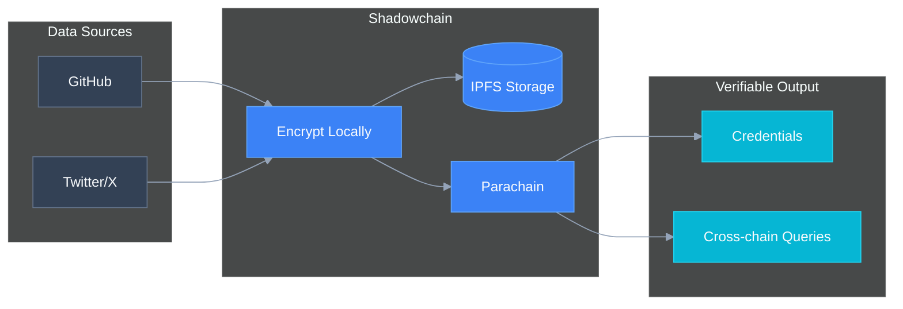
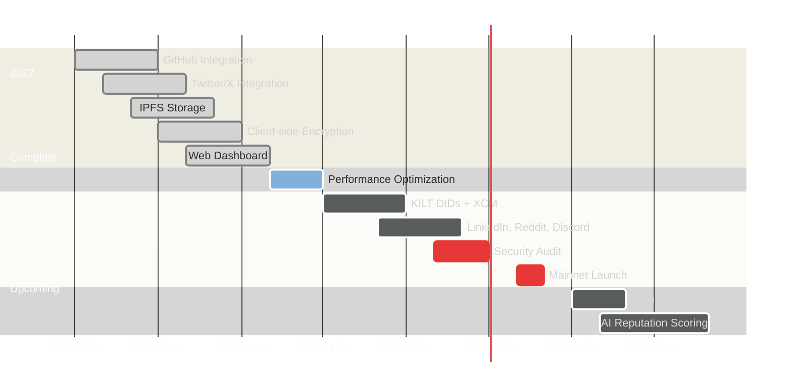

<div align="center">

# Shadowchain

**Decentralized Reputation Layer for the Open Internet**

[](https://github.com/paritytech/polkadot-sdk)
[](https://substrate.io)
[](https://ipfs.io)

Transform your Web2 footprint into verifiable Web3 identity

[Live Demo](https://shadowchain.locsafe.org) | [Docs](docs/arch.md) | [Discord](#)

</div>

---

## What is Shadowchain?

Shadowchain mirrors your digital activity from centralized platforms into a blockchain-verified, user-controlled archive. Your GitHub commits, tweets, and professional history become portable, verifiable credentials you actually own.

**The problem:** Platforms control your data. Accounts get suspended. APIs change. Your digital reputation is locked in silos you don't control.

**The solution:** Cryptographic proofs of your contributions, stored on IPFS, anchored on Polkadot. Portable across Web3. Owned by you.

---

## Architecture



**How it works:**
1. Authorize platform access via OAuth
2. Data encrypted client-side (keys never leave your device)
3. Encrypted blobs stored on IPFS
4. Content hashes anchored on Shadowchain parachain
5. Credentials queryable cross-chain via XCM

---

## Quick Start

```bash
git clone https://github.com/tufstraka/shadowchain.git
cd shadowchain
make install-deps
cp .env.example .env  # Add OAuth credentials
make dev              # Starts everything
```

Open `http://localhost:3000`, connect wallet, authorize platforms, mirror your data.

**Prerequisites:** Node.js 18+, Docker, Polkadot.js extension

---

## Use Cases

| Scenario | Problem | Shadowchain Solution |
|----------|---------|---------------------|
| **Developer hiring** | GitHub accounts can be faked | Blockchain-verified commit history |
| **DAO membership** | No proof of contribution | Reputation-weighted voting |
| **DeFi lending** | Requires overcollateralization | Reputation-based loan terms |
| **Deplatforming** | Lose years of content | Censorship-resistant archive |

---

## Tech Stack

| Layer | Technology |
|-------|------------|
| **Blockchain** | Substrate/FRAME, custom pallets |
| **Storage** | IPFS with XSalsa20-Poly1305 encryption |
| **Identity** | KILT DIDs, W3C Verifiable Credentials |
| **Interop** | XCM v3 cross-chain queries |

---

## Roadmap



---

## Security

- **Zero-knowledge:** Backend never sees plaintext data
- **Client-side encryption:** Keys derived from wallet signature
- **Selective disclosure:** Share only what you choose
- **Revocable:** Invalidate OAuth tokens anytime

---

## Contributing

We welcome contributions in Rust/Substrate, TypeScript, DevOps, and documentation.

See [CONTRIBUTING.md](CONTRIBUTING.md) for guidelines.

---

## Links

[Website](https://shadowchain.locsafe.org) | [GitHub](https://github.com/tufstraka/shadowchain) | [Twitter](https://twitter.com/shadowchain) | [Discord](https://discord.gg/shadowchain)

---

<div align="center">

**Built on Polkadot. Secured by cryptography. Owned by you.**

MIT License

</div>
